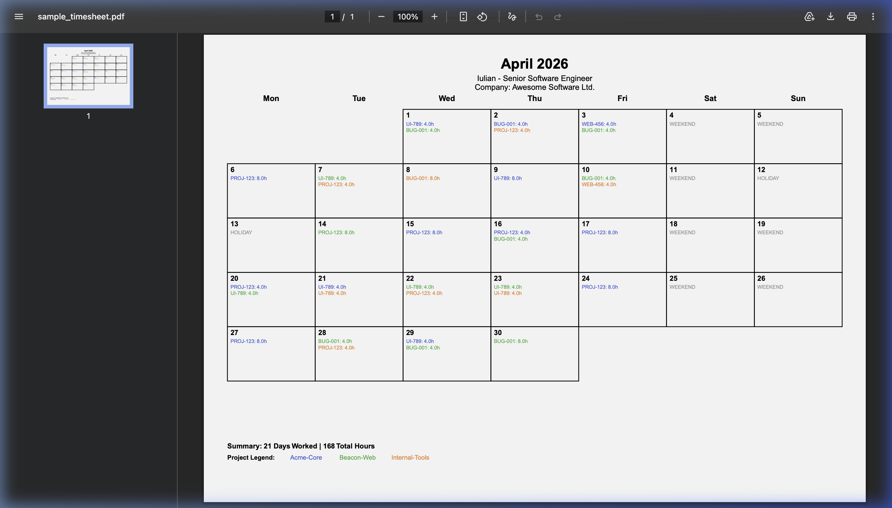
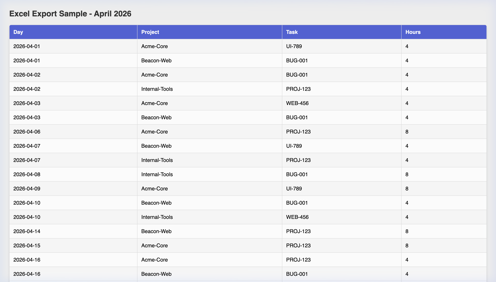

# Git Timesheet Generator (GGTS)

A multi-vendor, local-first Git activity aggregation and high-fidelity timesheet generation CLI.

The tool operates on a strict metadata-only principle—it analyzes timestamps, commit hashes, authors, and commit messages without ever reading your local file diffs or proprietary source code.

## Samples

| PDF Report | Excel Spreadsheet |
|:---:|:---:|
|  |  |

## Installation & Setup

1. **Prerequisites**: Have your Git provider tokens ready (see [Authentication](#authentication) below).
2. **Install**:
   ```bash
   npm install
   ```
3. **Configure**:
   ```bash
   npm run setup
   ```

The `setup` command is an interactive wizard that configures providers, authors, and PDF header info.

## Authentication

Devs: You'll need these tokens during `setup`. They are stored locally in `.ggts/secrets.json`.

| Provider | Token Location | Scopes Needed | Note |
| :--- | :--- | :--- | :--- |
| **GitHub** | Settings → Developer settings → PATs (Classic) | `repo` | |
| **GitLab** | User Settings → Access Tokens | `read_api` | |
| **Bitbucket** | Personal settings → App passwords | `Repositories: Read` | |

## Provider Configuration

During setup, you will need:
- **Bitbucket Workspace**: Unique ID from your URL: `bitbucket.org/WORKSPACE/`.
- **GitHub Owner**: Username or Organization name.
- **GitLab Project ID**: Numeric ID or full path (`namespace/project`).

## Monthly Workflow (End of Month)

Follow these steps at the end of each month before issuing your invoice:

1. **Sync Latest Activity**: Fetch the latest commits for the current month.
   ```bash
   npm run fetch
   ```
2. **Update Workdays**: Open `workdays.txt` and add the total number of days you worked for the month.
   ```text
   2025-04 - 21
   ```
3. **Generate Timesheet**: Create the professional PDF report.
   ```bash
   npm run timesheet
   ```
4. **Review**: Find your generated report in the `timesheets/` directory (e.g., `timesheets/2025-04_timesheet.pdf`).

---

## Usage

All commands are run via `npm run`. When passing flags (like `--year`), you must use a double-dash `--` to separate NPM arguments from CLI arguments.

### 1. Fetch Commits
Sync commits from your configured remote APIs and store them in a local `.ggts/` cache.
```bash
# Sync commits for the current year (default)
npm run fetch

# Sync commits for the past 5 years (skips already cached past months)
npm run fetch -- --years 5

# Re-fetch a specific month (even if already cached)
npm run fetch -- --month 2025-02

# Fetch only months that are completely missing from the .ggts/cache folder
npm run fetch -- --years 5 --missing-months

# Force re-fetch of everything in range
npm run fetch -- --years 2 --force
```

### Smart Sync & Monthly Cache
- The tool splits your history into monthly files in `.ggts/cache/`.
- It tracks a `sync_status.json` registry. If a past month is already marked as synced, it will skip API calls entirely.
- The **current month** is never skipped; it is always re-fetched to stay up-to-date.
- Use `--month` or `--force` to bypass this check and refresh historical data.

### 2. Configure Workdays
Create a `workdays.txt` file in the project root to specify exactly how many days you worked each month.
```text
# Format: YYYY-MM - DaysCount
2024-12 - 18
2025-01 - 21
```

### 3. Generate Calendar Timesheets
Generates professional monthly PDF/Excel files in the `timesheets/` folder.
By default, this command only runs for the **current month**.

```bash
# Generate PDF for the current month
npm run timesheet

# Generate PDF for a specific month
npm run timesheet -- --month 2026-04

# Generate PDF for the past 3 years (split into monthly files)
npm run timesheet -- --years 3

# Generate Excel files for a specific year
npm run timesheet -- --year 2025 --format xlsx
```

```

## Data Storage
- `.ggts/`: Local settings and commit cache (Gitignored).
- `workdays.txt`: Your manual workday counts (Gitignored).
- `timesheets/`: Generated reports (Gitignored).

## How it Works
1. **Incremental Fetch**: `fetch` only pulls what's missing since your last sync.
2. **Heuristic Engine**: Estimates work time based on commit frequency.
3. **Smart Filling**: If `workdays.txt` says you worked 21 days but you only have 19 active days, the tool fills the remaining 2 days prioritizing RO holidays then Saturdays.
4. **Project Coloring**: Each repository is assigned a deterministic color in the PDF legend.
